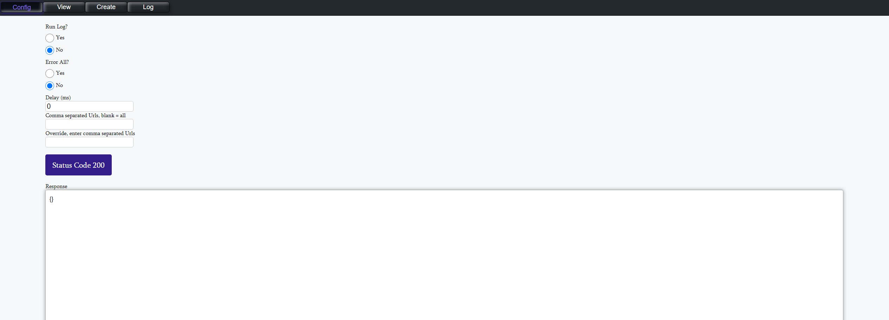

# Mock-Server

Used to mock endpoints

## Features

- Config: Configuration for adding delays to endpoint, erroring endpoints or turning log on
- View: View existing endpoints
- Create: Create new mock endpoints
- Log: will show which endpoints where hit if log is on

## Notes

- git history for this project is inside of playground project since this project was moved from there.
- project assumes folder called storage && storage/responses exists at root. As well as files config.json, log.json, mockPaths.json inside of storage.
